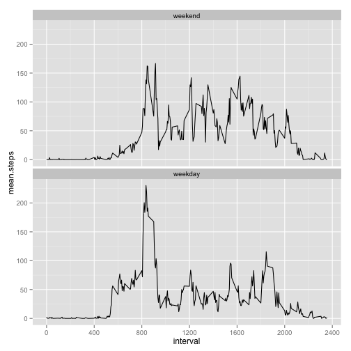

# Reproducible Research: Peer Assessment 1
=======================================================


## Loading and preprocessing the data


```r
setwd("~/Study/coursera-projects/RepData_PeerAssessment1")
Sys.setlocale("LC_TIME", "C")
```

```
## [1] "C"
```

```r
# loading csv file
activityData <- read.table("./data/activity.csv", sep=",", header=T, na.strings="NA",stringsAsFactors=F)

# make date as Date
activityData$date <- as.Date(activityData$date,"%Y-%m-%d")

summary(activityData)
```

```
##      steps            date               interval   
##  Min.   :  0.0   Min.   :2012-10-01   Min.   :   0  
##  1st Qu.:  0.0   1st Qu.:2012-10-16   1st Qu.: 589  
##  Median :  0.0   Median :2012-10-31   Median :1178  
##  Mean   : 37.4   Mean   :2012-10-31   Mean   :1178  
##  3rd Qu.: 12.0   3rd Qu.:2012-11-15   3rd Qu.:1766  
##  Max.   :806.0   Max.   :2012-11-30   Max.   :2355  
##  NA's   :2304
```

-------------------------------------------------------

## What is mean total number of steps taken per day?

### make dataset has total number of steps by each date

```r
library(plyr)
sumByDate <- ddply(na.omit(activityData),.(date),summarise,total.steps=sum(steps))
summary(sumByDate)
```

```
##       date             total.steps   
##  Min.   :2012-10-02   Min.   :   41  
##  1st Qu.:2012-10-16   1st Qu.: 8841  
##  Median :2012-10-29   Median :10765  
##  Mean   :2012-10-30   Mean   :10766  
##  3rd Qu.:2012-11-16   3rd Qu.:13294  
##  Max.   :2012-11-29   Max.   :21194
```

### 1. Make a histogram of the total number of steps taken each day

```r
hist(x=sumByDate$total.steps,breaks=20,xlab="Total Steps taken each day",main="Total Steps taken each day")
```

 

### 2. Calculate and report the mean and median total number of steps taken per day

```r
mean = mean(sumByDate$total.steps)
median = median(sumByDate$total.steps)
```
- The **mean** total number of steps taken per day is **10766**
- The **medial** total number of steps taken per day is **10765**

-------------------------------------------------------

## What is the average daily activity pattern?
### 1. Make a time series plot (i.e. type = "l") of the 5-minute interval (x-axis) and the average number of steps taken, averaged across all days (y-axis)


```r
library(plyr)
library(ggplot2)
meanByInterval<- ddply(na.omit(activityData),.(interval),summarise, mean.steps=mean(steps))
myPlot <- ggplot(meanByInterval,aes(x=interval, y=mean.steps)) + 
            scale_x_continuous(breaks=seq(0,2400,by=400)) + 
            geom_line() 

print(myPlot)
```

 

### 2. Which 5-minute interval, on average across all the days in the dataset, contains the maximum number of steps?

```r
max.step.interval <- meanByInterval$interval[which.max(meanByInterval$mean.steps)]
```
> The interval that contains the maximum number of steps is : **835**


-------------------------------------------------------


## Imputing missing values
>> Note that there are a number of days/intervals where there are missing values (coded as NA). The presence of missing days may introduce bias into some calculations or summaries of the data.

### 1. Calculate and report the total number of missing values in the dataset (i.e. the total number of rows with NAs)

```r
naSteps <- is.na(activityData$steps)
naFac <- mean(naSteps)
naFac
```

```
## [1] 0.1311
```
> The percentage of the missing value of stpes is  **13.1148%**

### 2. Devise a strategy for filling in all of the missing values in the dataset. The strategy does not need to be sophisticated. For example, you could use the mean/median for that day, or the mean for that 5-minute interval, etc.

> *My strategy for filling in the missing values is to change the missing value to the mean values for that interval.*


```r
activity.merged <- merge(activityData,meanByInterval,by="interval")
activity.merged$steps.fixed <- ifelse(is.na(activity.merged$steps),activity.merged$mean.steps,activity.merged$steps)
summary(activity.merged)
```

```
##     interval        steps            date              mean.steps    
##  Min.   :   0   Min.   :  0.0   Min.   :2012-10-01   Min.   :  0.00  
##  1st Qu.: 589   1st Qu.:  0.0   1st Qu.:2012-10-16   1st Qu.:  2.49  
##  Median :1178   Median :  0.0   Median :2012-10-31   Median : 34.11  
##  Mean   :1178   Mean   : 37.4   Mean   :2012-10-31   Mean   : 37.38  
##  3rd Qu.:1766   3rd Qu.: 12.0   3rd Qu.:2012-11-15   3rd Qu.: 52.83  
##  Max.   :2355   Max.   :806.0   Max.   :2012-11-30   Max.   :206.17  
##                 NA's   :2304                                         
##   steps.fixed   
##  Min.   :  0.0  
##  1st Qu.:  0.0  
##  Median :  0.0  
##  Mean   : 37.4  
##  3rd Qu.: 27.0  
##  Max.   :806.0  
## 
```
> *If the steps variable has a 'NA' value it takes the mean value of the interval, or value of itself*

### 3. Create a new dataset that is equal to the original dataset but with the missing data filled in.

```r
activity.fixed <- merge(activityData,activity.merged,by=c("date","interval"))[c(6,1,2)]
names(activity.fixed) <- names(activityData)
summary(activity.fixed)
```

```
##      steps            date               interval   
##  Min.   :  0.0   Min.   :2012-10-01   Min.   :   0  
##  1st Qu.:  0.0   1st Qu.:2012-10-16   1st Qu.: 589  
##  Median :  0.0   Median :2012-10-31   Median :1178  
##  Mean   : 37.4   Mean   :2012-10-31   Mean   :1178  
##  3rd Qu.: 27.0   3rd Qu.:2012-11-15   3rd Qu.:1766  
##  Max.   :806.0   Max.   :2012-11-30   Max.   :2355
```

### 4. Make a histogram of the total number of steps taken each day and Calculate and report the mean and median total number of steps taken per day. Do these values differ from the estimates from the first part of the assignment? What is the impact of imputing missing data on the estimates of the total daily number of steps?


```r
sumByDate.fixed <- ddply(activity.fixed,.(date),summarise,total.steps=sum(steps))
hist(x=sumByDate.fixed$total.steps,breaks=20,xlab="Total Steps taken each day",main="Total Steps taken each day")
```

 

```r
fixed.mean = mean(sumByDate.fixed$total.steps)
fixed.median = median(sumByDate.fixed$total.steps)

fixed.mean
```

```
## [1] 10766
```

```r
fixed.median
```

```
## [1] 10766
```
> *The fixed mean and median value is **1.0766 &times; 10<sup>4</sup>** , **1.0766 &times; 10<sup>4</sup>**. These two value is same as each other. It's likely that there is no impact of imputing missing data by change to mean of interval on the estimates of the total daily number of steps.*

------------------------------------------------------------

## Are there differences in activity patterns between weekdays and weekends?
> For this part the weekdays() function may be of some help here. Use the dataset with the filled-in missing values for this part.

### 1. Create a new factor variable in the dataset with two levels – “weekday” and “weekend” indicating whether a given date is a weekday or weekend day.


```r
activity.fixed$is.weekend <- ifelse(weekdays(activity.fixed$date) %in% c("Sunday","Saturday"), "weekend", "weekday")
activity.fixed$is.weekend <- factor(activity.fixed$is.weekend,levels=c("weekend","weekday"))
summary(activity.fixed)
```

```
##      steps            date               interval      is.weekend   
##  Min.   :  0.0   Min.   :2012-10-01   Min.   :   0   weekend: 4608  
##  1st Qu.:  0.0   1st Qu.:2012-10-16   1st Qu.: 589   weekday:12960  
##  Median :  0.0   Median :2012-10-31   Median :1178                  
##  Mean   : 37.4   Mean   :2012-10-31   Mean   :1178                  
##  3rd Qu.: 27.0   3rd Qu.:2012-11-15   3rd Qu.:1766                  
##  Max.   :806.0   Max.   :2012-11-30   Max.   :2355
```


### 2. Make a panel plot containing a time series plot (i.e. type = "l") of the 5-minute interval (x-axis) and the average number of steps taken, averaged across all weekday days or weekend days (y-axis). The plot should look something like the following, which was creating using simulated data:


```r
library(plyr)
library(ggplot2)
activity.weekday <- ddply(activity.fixed, c("interval","is.weekend"), summarise, mean.steps = mean(steps))

ggplot(activity.weekday,aes(x=interval, y=mean.steps)) + 
            scale_x_continuous(breaks=seq(0,2400,by=400)) + 
            geom_line() +
            facet_wrap( ~ is.weekend, nrow=2)
```

 

