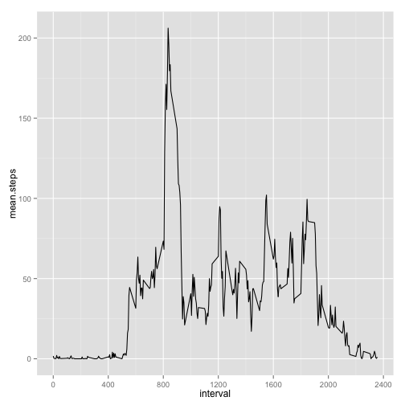

# Reproducible Research: Peer Assessment 1
=======================================================


## Loading and preprocessing the data


```r
setwd("~/Study/coursera-projects/RepData_PeerAssessment1")

# loading csv file
activityData <- read.table("./data/activity.csv", sep=",", header=T, na.strings="NA",stringsAsFactors=F)

# make date as Date
activityData$date <- as.Date(activityData$date,"%Y-%m-%d")

summary(activityData)
```

```
##      steps            date               interval   
##  Min.   :  0.0   Min.   :2012-10-01   Min.   :   0  
##  1st Qu.:  0.0   1st Qu.:2012-10-16   1st Qu.: 589  
##  Median :  0.0   Median :2012-10-31   Median :1178  
##  Mean   : 37.4   Mean   :2012-10-31   Mean   :1178  
##  3rd Qu.: 12.0   3rd Qu.:2012-11-15   3rd Qu.:1766  
##  Max.   :806.0   Max.   :2012-11-30   Max.   :2355  
##  NA's   :2304
```

-------------------------------------------------------

## What is mean total number of steps taken per day?

### make dataset has total number of steps by each date

```r
library(plyr)
sumByDate <- ddply(na.omit(activityData),.(date),summarise,total.steps=sum(steps))
summary(sumByDate)
```

```
##       date             total.steps   
##  Min.   :2012-10-02   Min.   :   41  
##  1st Qu.:2012-10-16   1st Qu.: 8841  
##  Median :2012-10-29   Median :10765  
##  Mean   :2012-10-30   Mean   :10766  
##  3rd Qu.:2012-11-16   3rd Qu.:13294  
##  Max.   :2012-11-29   Max.   :21194
```

### 1. Make a histogram of the total number of steps taken each day

```r
hist(x=sumByDate$total.steps,breaks=10,xlab="Total Steps taken each day",main="Total Steps taken each day")
```

 

### 2. Calculate and report the mean and median total number of steps taken per day

```r
mean = mean(sumByDate$total.steps)
median = median(sumByDate$total.steps)
```
- The **mean** total number of steps taken per day is **10766**
- The **medial** total number of steps taken per day is **10765**

-------------------------------------------------------

## What is the average daily activity pattern?
### Make a time series plot (i.e. type = "l") of the 5-minute interval (x-axis) and the average number of steps taken, averaged across all days (y-axis)


```r
library(plyr)
library(ggplot2)
meanByInterval<- ddply(na.omit(activityData),.(interval),summarise, mean.steps=mean(steps))
myPlot <- ggplot(meanByInterval,aes(x=interval, y=mean.steps)) + 
            scale_x_continuous(breaks=seq(0,2400,by=400)) + 
            geom_line() 

print(myPlot)
```

 


## Imputing missing values


## Are there differences in activity patterns between weekdays and weekends?
